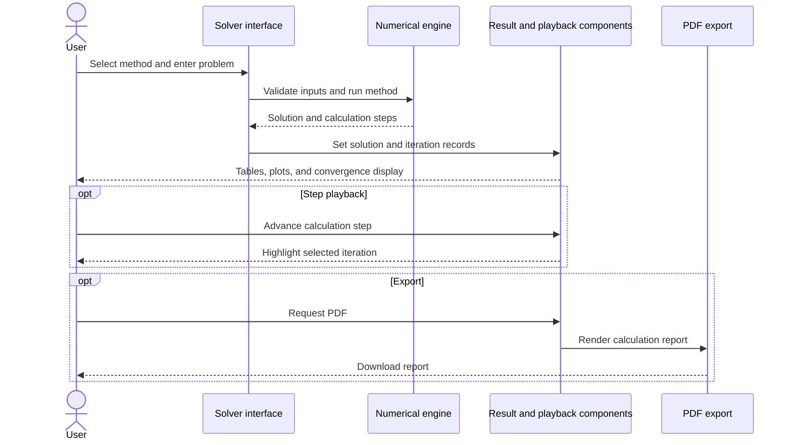

# NumeriX — Numerical Analysis Lab

An interactive numerical analysis learning application with solvers, method comparison, error visualizations, and additional mathematical labs.

**Technology:** React 18 · TypeScript · Vite · mathjs · KaTeX · Three.js

## Features

- Explore five root-finding methods and four linear-system methods.
- Inspect iteration tables, step playback, convergence displays, and PDF export.
- Compare root-finding methods in the comparison lab.
- Study method pages, error geometry, and an equation playground.
- Use quiz, whiteboard, and Newton-fractal pages.

## Repository guide

| Path | Purpose |
|---|---|
| [src/lib/numerical](src/lib/numerical) | Math engine, methods, and validation helpers. |
| [src/components/solver](src/components/solver) | Input forms and solver results. |
| [src/components/compare](src/components/compare) | Method comparison interface. |
| [src/pages](src/pages) | Learning pages and labs. |
| [src/state/AppContext.tsx](src/state/AppContext.tsx) | Shared application state. |
| [DEPLOY.md](DEPLOY.md) | Deployment notes. |

## Requirements and current limitations

Numerical operations run in the client; there is no required model API or database for the core solvers. Method metadata such as relative speed indicators is instructional rather than a universal benchmark. Choose appropriate bounds, starting values, and stopping criteria for each problem.

## UML diagrams

### Main workflow

The solver prepares a problem for the browser engine, then supplies iteration data to the result components and optional PDF export.



## Getting started

```bash
git clone https://github.com/IbrahimAbdelsattar/Numerix.git
cd Numerix
```

```bash
npm install
npm run dev
```

Open the local origin printed by the development server.

### Available scripts

| Command | Purpose |
|---|---|
| `npm run build` | Create a production build. |
| `npm run lint` | Run the configured lint/type checks. |
| `npm run test` | Run the configured test suite. |
| `npm run typecheck` | Check TypeScript types. |
| `npm run preview` | Preview the Vite production build. |
