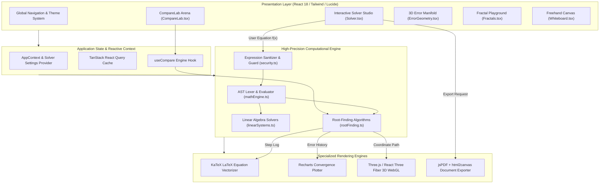

<br/><br/>

<!-- Animated Title -->
<p align="center">
  <a href="#">
    
  </a>
</p>

<p align="center">
  <b>High-Performance Interactive Numerical Analysis & Mathematical Computing Web Platform</b><br/>
  <i>Step-by-Step Algorithmic Solvers · Multi-Method Race Dashboard · 3D Error Topologies · Real-Time Convergence Benchmarks · Interactive Pedagogical Labs</i>
</p>

<br/>

<!-- Badges Row 1: Frameworks & Language -->
<p align="center">
  
  
  
  
  
</p>

<!-- Badges Row 2: Mathematical Computation & UI -->
<p align="center">
  
  
  
  
  
</p>

<!-- Badges Row 3: Standards & Status -->
<p align="center">
  
  
  
  
</p>

<br/>

<!-- Quick Navigation Bar -->
<p align="center">
  <a href="#-overview"></a>
  &nbsp;
  <a href="#-problem-statement--pedagogical-solution"></a>
  &nbsp;
  <a href="#-core-modules--features"></a>
  &nbsp;
  <a href="#%EF%B8%8F-system-architecture"></a>
  &nbsp;
  <a href="#-implemented-algorithms-registry"></a>
  &nbsp;
  <a href="#-technical-stack"></a>
  &nbsp;
  <a href="#-quickstart--development"></a>
</p>

---

## 📌 Overview

**Numerix** is a high-performance, interactive numerical analysis and computational mathematics platform. Engineered for researchers, applied mathematicians, computer scientists, and engineering students, Numerix transforms abstract numerical methods from dry formulas into **dynamic, visual, and benchmarkable simulations**.

Rather than outputting static floating-point results, Numerix reveals the entire operational anatomy of numerical algorithms:
- **Exact Iterative Trajectories**: Watch intervals shrink in Bisection, tangents extrapolate in Newton-Raphson, and row operations systematically transform augmented matrices in Gauss Elimination.
- **Side-by-Side Algorithm Races (CompareLab)**: Benchmark multiple solvers simultaneously against identical objective functions to compare convergence orders (Linear, Superlinear, Quadratic), iteration counts, execution latencies, and truncation errors.
- **3D Error Topology (ErrorGeometry)**: WebGL-accelerated 3D surface visualizations powered by Three.js that map error landscapes, local minima, stagnation zones, and divergence boundaries.
- **Interactive Laboratories**: Deep pedagogical workspaces including Julia/Mandelbrot Fractal Explorers, a Freehand Math Whiteboard, and dynamic Knowledge Quizzes with real-time feedback.

```
                      ┌────────────────────────────────────────────────────────┐
                      │                     Numerix Core                       │
                      │                                                        │
[ f(x) or Matrix A|b ]──┼──> [ Math.js Lexer & AST Parser ] ──> Expression Tree  ├──> [ Interactive Studio ]
                      │             │                                          │    - KaTeX Step-by-Step Proof
                      │             ▼                                          │    - Recharts Error Plot
                      │    [ High-Precision Solvers ] ──> Iteration State Log  │    - CompareLab Benchmark Race
                      │             │                                          │    - 3D WebGL Error Surface
                      │             ▼                                          │    - Exportable LaTeX PDF Report
                      │    [ WebGL / Three.js Canvas ] ──> 3D Geometry Shader  │
                      └────────────────────────────────────────────────────────┘
```

---

## 🎯 Problem Statement & Pedagogical Solution

<table>
<tr>
<td width="50%" valign="top">

### ❌ The Educational & Computational Bottleneck

Traditional numerical analysis tools suffer from severe limitations:

- 📖 **Static Textbook Presentations**: Step-by-step derivations are frozen on printed pages without interactive feedback loops.
- 🕳️ **Black-Box Libraries (`scipy.optimize`)**: Students and practitioners call `.root()` without understanding convergence criteria, conditioning, or divergence traps.
- 📉 **Invisible Error Dynamics**: Truncation, roundoff, and absolute relative approximation errors $\varepsilon_a$ are rarely visualized over iterations.
- 🏎️ **Unverifiable Performance Claims**: Comparing quadratic vs. linear convergence is difficult without real-time race dashboards.
- 💻 **Complex Environment Setup**: Running MATLAB, Fortran, or Python notebooks requires hefty runtimes and configuration.

</td>
<td width="50%" valign="top">

### ✅ The Numerix Solution

| Challenge | Numerix Architectural Solution |
| :--- | :--- |
| **Interactive Derivations** | **Live KaTeX Rendering**: Full step-by-step mathematical expansions updated instantaneously per iteration. |
| **Glass-Box Computation** | **Complete State Inspections**: Full table of brackets $[x_l, x_u]$, estimates $x_r$, functional values $f(x_r)$, and $\varepsilon_a\%$. |
| **Dynamic Visuals** | **Multi-Tier Plots**: Dual-axis Recharts graphs and interactive Three.js 3D error manifolds. |
| **Algorithm Racing** | **CompareLab**: Head-to-head performance matrix benchmarking speed, iterations, and convergence rates. |
| **Zero-Install Client** | **Vite + React Single Page Architecture**: Runs 100% in-browser with zero server-side latency or dependencies. |
| **Comprehensive Labs** | Integrated **Fractal Generators**, **Freehand Whiteboard**, and **Adaptive Quizzes**. |

</td>
</tr>
</table>

---

## 🔥 Core Modules & Features

<table>
<tr>
<td width="33%" align="center" valign="top">

### 🧮 Comprehensive Solvers
<br/>
<b>Root-Finding & Linear Systems</b>
<p align="left">
• 5 Root-Finding algorithms (Bisection, False Position, Fixed Point, Newton-Raphson, Secant)<br/>
• 4 Linear Systems solvers (Gauss, LU, Gauss-Jordan, Cramer)<br/>
• Real-time equation syntax verification<br/>
• Step-by-step tabular iterations<br/>
• High-precision stopping criteria ($\varepsilon_s$)
</p>

</td>
<td width="33%" align="center" valign="top">

### 🏎️ CompareLab Benchmark
<br/>
<b>Live Algorithm Races</b>
<p align="left">
• Multi-algorithm simultaneous execution<br/>
• Interactive race replay animations<br/>
• Convergence speed comparison gauges<br/>
• Cumulative iteration cost heatmaps<br/>
• Failure & divergence boundary checks
</p>

</td>
<td width="33%" align="center" valign="top">

### 🌐 3D Error Geometry
<br/>
<b>Three.js WebGL Visualization</b>
<p align="left">
• Hardware-accelerated 3D error surfaces<br/>
• Interactive orbital rotation and zoom<br/>
• Real-time step trajectory projection<br/>
• Saddle point & local minima inspection<br/>
• Color-mapped gradient contours
</p>

</td>
</tr>
<tr>
<td width="33%" align="center" valign="top">

### 🌀 Fractal Laboratories
<br/>
<b>Mandelbrot & Julia Sets</b>
<p align="left">
• High-resolution canvas rendering<br/>
• Arbitrary precision zoom capabilities<br/>
• Dynamic parameter adjustments<br/>
• Custom spectral color palettes<br/>
• Iteration escape-time shaders
</p>

</td>
<td width="33%" align="center" valign="top">

### 📝 Freehand Whiteboard
<br/>
<b>Collaborative Mathematical Canvas</b>
<p align="left">
• Vector pen, highlighter, and geometry tools<br/>
• Grid, dot, and isometric paper styles<br/>
• Embedded formula scratchpad<br/>
• One-click PNG and SVG export<br/>
• Local state persistence
</p>

</td>
<td width="33%" align="center" valign="top">

### 📄 Export & Reporting
<br/>
<b>LaTeX & PDF Engine</b>
<p align="left">
• Instant publication-ready PDF exports<br/>
• High-fidelity KaTeX equation vectorization<br/>
• Embedded convergence charts via html2canvas<br/>
• Complete iteration tables and audit trails<br/>
• Academic citations and metadata
</p>

</td>
</tr>
</table>

---

## 🏗️ System Architecture

Numerix follows a modern, decoupled **Single-Page Application (SPA)** architecture prioritizing zero-latency calculation, mathematical purity, and immediate visual reactivity.



---

## 🔬 Implemented Algorithms Registry

Numerix includes 9 production-grade algorithms covering root-finding and linear algebraic systems:

### 1. Non-Linear Root-Finding Solvers

| Method | Order of Convergence | Required Inputs | Strengths & Failure Modes |
| :--- | :--- | :--- | :--- |
| **Bisection** | **Linear** ($O(1)$) | Bracket $[x_l, x_u]$ where $f(x_l)f(x_u) < 0$ | Guaranteed to converge if root is bracketed. Slower than open methods; fails if root has even multiplicity. |
| **False Position** (Regula Falsi) | **Linear** | Bracket $[x_l, x_u]$ | Uses linear secant interpolation. Faster than Bisection for smooth curves; can stagnate on convex curves. |
| **Fixed Point Iteration** | **Linear** | Reformulation $x = g(x)$, initial $x_0$ | Elegant and intuitive. Requires $|g'(x)| < 1$ within the neighborhood of the root for guaranteed convergence. |
| **Newton-Raphson** | **Quadratic** ($O(2)$) | Initial guess $x_0$, derivative $f'(x)$ | Exceptionally fast near the root. Can diverge if $f'(x) \approx 0$, cycle infinitely, or jump to remote roots. |
| **Secant Method** | **Superlinear** ($O(1.618)$) | Two initial guesses $x_0, x_1$ | Approximates $f'(x)$ via finite differences. Fast without requiring analytic derivatives; potential division by zero. |

### 2. Systems of Linear Equations ($A \mathbf{x} = \mathbf{b}$)

| Method | Classification | Time Complexity | Implementation Highlights |
| :--- | :--- | :--- | :--- |
| **Gauss Elimination** | **Direct** | $O(\frac{2}{3}n^3)$ | Forward elimination to upper triangular form followed by systematic back-substitution. Partial pivoting supported. |
| **LU Decomposition** | **Direct** | $O(\frac{2}{3}n^3)$ | Factors coefficient matrix $A = L \cdot U$. Enables rapid solution of multiple right-hand side vectors $\mathbf{b}$ in $O(n^2)$. |
| **Gauss-Jordan** | **Direct** | $O(n^3)$ | Transforms augmented matrix $[A \mid \mathbf{b}]$ directly to reduced row echelon form $[I \mid \mathbf{x}]$; also used for matrix inversion. |
| **Cramer's Rule** | **Direct** | $O((n+1)!)$ | Determinant ratio formulation $x_i = \frac{\det(A_i)}{\det(A)}$. High educational clarity for $n \le 4$. |

---

## ⚙️ Technical Stack

| Layer | Technology | Version / Specification | Description |
| :--- | :--- | :--- | :--- |
| **UI Framework** | **React** | `18.3.1` | Core declarative component architecture |
| **Language** | **TypeScript** | `5.8.3` | Strict typing across state, mathematical types, and method schemas |
| **Bundler & Tooling** | **Vite** | `5.4.19` | Ultra-fast HMR and optimized production rollups |
| **Styling** | **Tailwind CSS** | `3.4.17` | Modern dark-mode optimized utilities and glassmorphism |
| **Component Primitives** | **Radix UI** | Complete Suite | Fully accessible modal, slider, tabs, and tooltip components |
| **3D Engine** | **Three.js & Drei** | `three 0.160` / `@react-three/fiber` | Hardware-accelerated WebGL 3D error topologies |
| **Math Parser** | **Math.js** | `15.2.0` | High-precision numerical evaluation and expression parsing |
| **Math Typesetting** | **KaTeX** | `0.16.45` | Sub-millisecond LaTeX mathematical formula rendering |
| **Data Visualization** | **Recharts** | `2.15.4` | Responsive SVG convergence curves and error area plots |
| **Document Generation** | **jsPDF + html2canvas** | `jspdf 4.2.1` | Client-side vector PDF generation and canvas snapshotting |
| **Testing Suite** | **Vitest** | `3.2.4` | High-speed unit and integration testing suite |

---

## 📁 Repository Structure

```
Numerix/
├── 📄 package.json                 # Frontend dependencies, build scripts & metadata
├── 📄 vite.config.ts               # Vite build configuration, plugins & path aliases
├── 📄 tailwind.config.ts           # Tailwind CSS configuration with custom typography & palettes
├── 📄 tsconfig.json                # TypeScript project configuration & strict mode flags
├── 📄 vitest.config.ts             # Unit testing configuration for mathematical algorithms
├── 📄 DEPLOY.md                    # Cloud deployment instructions (Vercel, Netlify, Cloudflare)
├── 📄 index.html                   # HTML entry point with Google Fonts & KaTeX stylesheets
│
├── 📁 public/                      # Static assets, favicon & logos
│
└── 📁 src/                         # Application Source Code
    ├── 📄 App.tsx                  # React Router configuration & global providers
    ├── 📄 main.tsx                 # Application DOM bootstrap
    │
    ├── 📁 lib/                     # Core Mathematical & Utility Libraries
    │   ├── 📁 numerical/           # Mathematical Algorithms Implementation
    │   │   ├── 📄 index.ts         # Unified barrel exports for solvers
    │   │   ├── 📄 methods.ts       # Central method metadata, difficulty & examples registry
    │   │   ├── 📄 mathEngine.ts    # Math.js wrapper, parsing, safety checks & function evaluation
    │   │   ├── 📄 rootFinding.ts   # Implementations: Bisection, False Position, Newton, Secant, Fixed Point
    │   │   ├── 📄 linearSystems.ts # Implementations: Gauss, LU, Gauss-Jordan, Cramer
    │   │   ├── 📄 security.ts      # Mathematical AST sanitization (blocking prototype pollution)
    │   │   └── 📄 types.ts         # Computational interfaces, step logs & error types
    │   ├── 📄 quizGenerator.ts     # Algorithmic numerical analysis problem generator
    │   └── 📄 utils.ts             # Class merger utilities (clsx, tailwind-merge)
    │
    ├── 📁 pages/                   # Application Pages & View Studios
    │   ├── 📄 Landing.tsx          # Hero page with dynamic feature spotlights
    │   ├── 📄 Solver.tsx           # Step-by-step solver studio with KaTeX & Recharts
    │   ├── 📄 CompareLab.tsx       # Multi-method head-to-head benchmarking arena
    │   ├── 📄 ErrorGeometry.tsx    # Three.js 3D error surface visualization
    │   ├── 📄 LearnHub.tsx         # Comprehensive pedagogical theory & derivations
    │   ├── 📄 Whiteboard.tsx       # Freehand mathematical drawing & derivation board
    │   ├── 📄 Quiz.tsx             # Interactive numerical analysis assessment module
    │   ├── 📁 labs/                # Interactive Explorers
    │   │   └── 📄 Fractals.tsx     # Mandelbrot & Julia set explorer
    │   └── 📁 learn/               # Detailed theory pages & sandbox playgrounds
    │       ├── 📄 MethodPage.tsx   # In-depth algorithmic breakdowns
    │       └── 📄 Playground.tsx   # Freeform function sandbox
    │
    ├── 📁 components/              # UI Components & Modules
    │   ├── 📁 compare/             # CompareLab dashboard, race controls & benchmark charts
    │   ├── 📁 layout/              # Navbar, Footer, and ThemeToggle
    │   └── 📁 ui/                  # Accessible Radix UI design primitives
    │
    ├── 📁 state/                   # React Context State Providers
    │   └── 📄 AppContext.tsx       # Active solver state, history & preferences
    │
    └── 📁 test/                    # Unit Tests
        └── 📄 numerical.test.ts    # Verification tests for convergence & roots
```

---

## 🚀 Quickstart & Development

### Prerequisites
- **Node.js**: Version 18.x or higher (Node 20+ recommended)
- **Package Manager**: `npm`, `pnpm`, or `bun`

---

### 1. Local Setup

```bash
# 1. Clone repository
git clone https://github.com/IbrahimAbdelsattar/Numerix.git
cd Numerix

# 2. Install dependencies
npm install

# 3. Start development server
npm run dev
```

*The application will boot instantly at `http://localhost:5173`.*

---

### 2. Running Verification & Unit Tests

Validate numerical algorithms against analytical benchmarks:

```bash
# Run all unit tests with Vitest
npm run test

# Run tests in continuous watch mode
npm run test:watch

# Execute TypeScript type verification
npm run typecheck
```

---

### 3. Production Build & Deployment

Generate an optimized, tree-shaken static production bundle:

```bash
# Build production bundle
npm run build

# Preview production bundle locally
npm run preview
```

*The output in `dist/` can be deployed directly to **Vercel**, **Netlify**, **Cloudflare Pages**, or **GitHub Pages**.*

---

## 🛡️ Mathematical Security & Guardrails

1. **AST Sanitization (`security.ts`)**: All user-provided mathematical expressions are parsed into an Abstract Syntax Tree (AST) before execution. Potentially dangerous JavaScript globals (`window`, `eval`, `process`, `Function`) are strictly rejected.
2. **Infinite Loop Protection**: All iterative algorithms enforce strict iteration ceilings (`maxIterations = 100`) and divergence guards ($\Delta x > 10^8$) to protect client thread stability.
3. **Division-by-Zero Traps**: Intermediate denominators (such as $f'(x) \to 0$ in Newton-Raphson or $f(x_u) - f(x_l) \to 0$ in False Position) trigger immediate, descriptive warnings rather than producing unhandled `NaN` or `Infinity` crashes.

---

## 👥 Author & Connect

**Ibrahim Abdelsattar**  
*AI Engineer & Machine Learning Specialist*

- 🌐 **GitHub**: [@IbrahimAbdelsattar](https://github.com/IbrahimAbdelsattar)
- 💼 **LinkedIn**: [Ibrahim Abdelsattar](https://www.linkedin.com/in/ibrahim-abdelsattar/)
- 📧 **Email**: [ibrahimabdelsattar042@gmail.com](mailto:ibrahimabdelsattar042@gmail.com)

---

<p align="center">
  <sub>Engineered with precision for computational elegance & mathematical discovery. © 2026 Numerix.</sub>
</p>
